<h1 align="center"> Python Flask API to Code Engine </h1>
<p align="center"> Deploy kontainer Docker yang berisi Flask API untuk load model Machine Learning berbasis Saved Model dari Keras dan TensorFlow ke layanan IBM Cloud Code Engine</p>

<div align="center">


</div>

# A. Syarat

- Perangkat dengan sistem Windows 10/11 64-bit
- RAM minimal 4GB
- Penyimpanan tersisa minimal 50-70GB
- Aplikasi Postman (download [disini](https://www.postman.com/downloads/)) +- 130MB
- Docker Desktop (download [disini](https://www.docker.com/products/docker-desktop/)) +- 500MB
- Python 3.8+ 
- Akun Docker Hub (daftar [disini](https://hub.docker.com/signup))
- Akun IBM Cloud 


# B. Langkah - langkah
Langkah - langkah akan dibuat per bagian dan akan memiliki sub bagian.

## 1. Persiapan akun dan repositori DockerHub
- Pastikan akun DockerHub sudah dibuat : 


- Klik bagian 'Repositories' lalu buat sebuah repositori kosong baru


- Buat nama repositori sesuka hati, nama ini akan dibuat sama dengan nama Docker image nantinya, biarkan _visibility_ di 'Public'.


- Repositori berhasil dibuat.
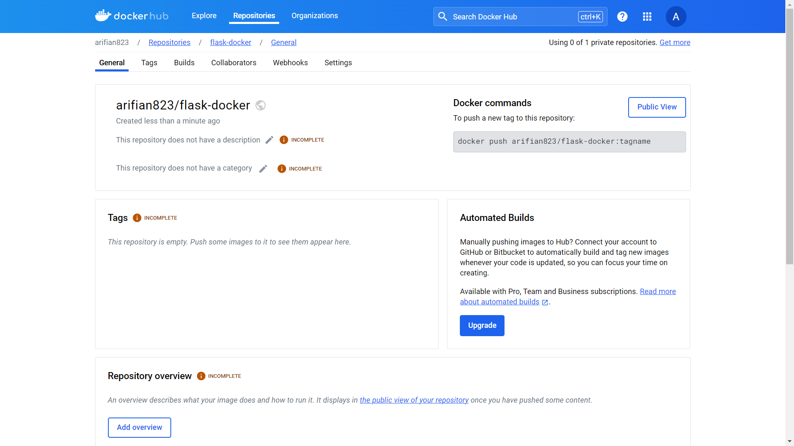

- Instal lalu buka aplikasi Docker Desktop anda

Ini merupakan tampilan awal dari aplikasi Docker Desktop.

- Pastikan Docker Machine sudah dalam status hijau dan 'running' (ada di pojok kiri bawah)
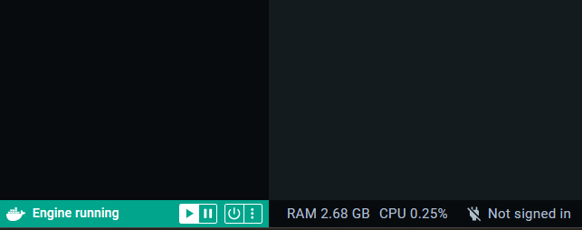

- Silakan login ke akun DockerHub anda di aplikasi Docker Desktop. (Tombol putih pojok kanan atas)


- Anda akan dibawa ke browser, dan ikuti saja step nya.
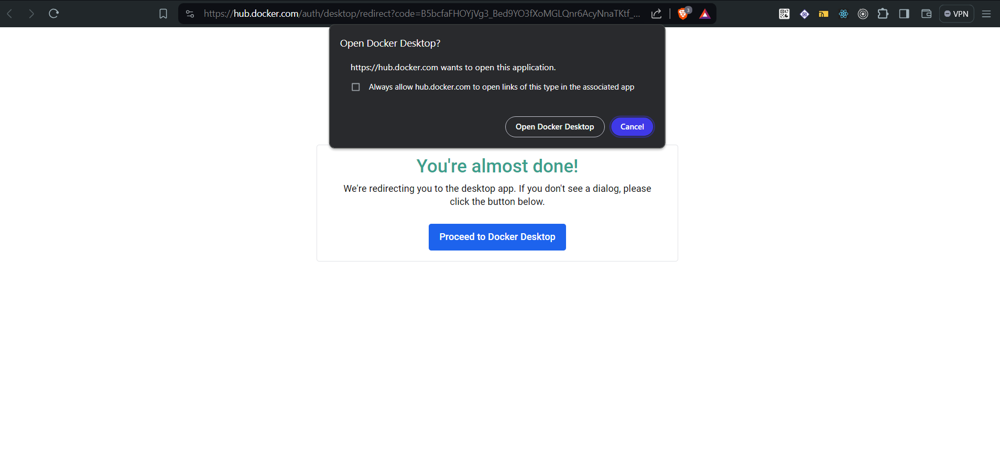

- Berikut tampilan jika anda sudah login ke Aplikasi Docker

Akun anda akan berada di pojok kanan atas. Lanjutkan ke **tahap 2.**


## 2. Pastikan Flask API anda telah bekerja dengan baik

- Buka project Flask API anda <br />


Ini merupakan struktur folder untuk proyek contoh yang ada di repositori ini.

-  Buka terminal anda, dan jalankan proyek Flask API anda dengan 
```
python -m flask run
```
Atau
```
python3 -m flask run
```
Atau
```
py -m flask run
```
Atau
```
python app.py / python3 app.py / py app.py
```
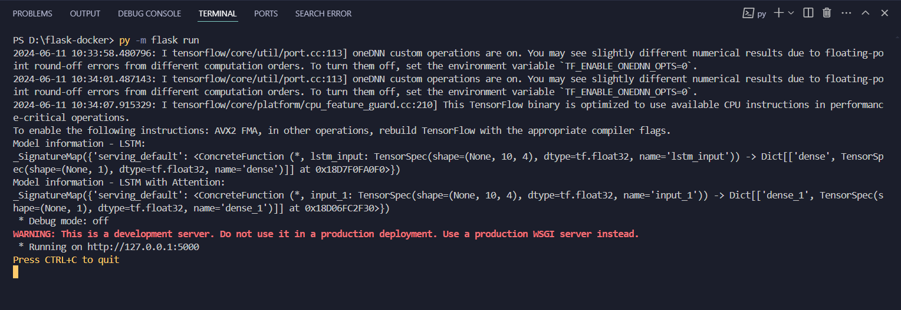

Jika berjalan dengan aman di alamat ```http://127.0.0.1:5000``` atau ```http://localhost:5000``` dengan port 5000 (yang merupakan default), maka anda bisa lanjut ke **tahap 3**. Jika belum, silakan perbaiki hingga aplikasi Flask anda berjalan dengan baik.

## 3. Pembuatan Docker Image

- Pergi ke Visual Studio Code dan buka projek Flask API anda, dan buatlah sebuah ``` Dockerfile ```


Proyek ini akan menggunakan docker base image dari python3.8-slim-buster
```
FROM python:3.8-slim-buster
```

Untuk isi dari file ini, silakan sesuaikan dengan kebutuhan anda, terutama untuk pemasangan dependency yang ada pada ``` requirements.txt ```

Sisanya, tidak perlu diubah banyak, silakan ikuti format diatas saja.

- Kembali ke terminal, lalu buat Docker Image dengan perintah berikut :

```
docker build --tag flask-docker .
```

``` flask-docker ``` akan menjadi nama dari Docker Image anda.

- Setelahnya, tunggu proses pembuatan Docker Image, yang akan memakan waktu hingga 10-20 menit dan menggunakan ruang sebanyak 4-5 GB.
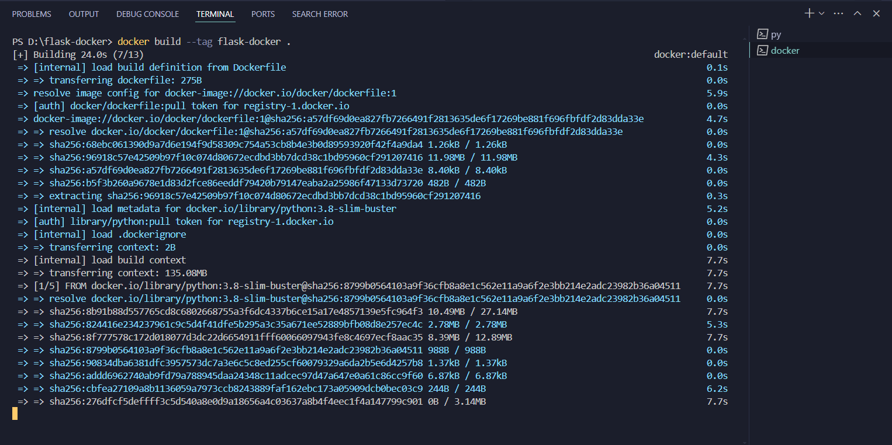

- Berikut jika pembuatan Docker Image sudah selesai.

- Cek image yang tersedia dengan perintah : 

```
docker images
```


```flask-docker``` adalah nama dari Docker Image yang berhasil dibuat dari proyek Flask API sebelumnya. Disesuaikan dengan nama repositori yang sebelumnya dibuat di DockerHub.

- Jalankan Docker Image menggunakan port 5000 untuk browser dari sistem host (mode detached) dengan perintah berikut: 

```
docker run -d -p 5000:5000 flask-docker
```

```-d``` untuk mengaktifkan image dalam mode detached. <br />
```-p``` untuk menspesifikkan nomor port. Kita akan menggunakan port 5000 yang merupakan default dari Flask.
<br />
Berikut adalah ketika Docker Image sudah berjalan : 


Image yang sedang berjalan dapat di cek menggunakan command:
```
docker ps
```

- Cek apakah Flask API didalam kontainer Docker Image sudah bisa diakses atau belum di port 5000

- Melalui browser, buka ```http://localhost:5000```


Tulisan 'Hello World!' yang merupakan isi dari route '/' atau route utama pada Flask API sudah dapat ditampilkan.

- Melalui aplikasi Postman
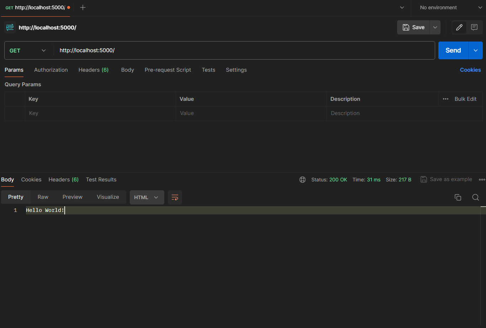

Gunakan method **GET** lalu masukkan alamat ```http://localhost:5000``` untuk melihat hasil yang diberikan yaitu pada bagian 'body'.

- Mencoba kinerja model melalui aplikasi Postman

Gunakan method **POST** lalu masukkan alamat ```http://localhost:5000/predict``` , lalu pilih **Body** dan pilih 'raw' pada tab dibawah kolom input dan pilih JSON pada pilihan dropdown di tab tersebut.

Gunakan data ini (silakan diubah sesuka hati nilainya) pada 'Body' dan pilih JSON sebagai format: 

```
{
  "input": [
    {"Tavg": 27, "RH_avg": 89, "ss": 6, "ff_avg": 4},
    {"Tavg": 24, "RH_avg": 89, "ss": 4, "ff_avg": 7},
    {"Tavg": 29, "RH_avg": 78, "ss": 6, "ff_avg": 5},
    {"Tavg": 33, "RH_avg": 77, "ss": 8, "ff_avg": 3},
    {"Tavg": 33, "RH_avg": 76, "ss": 9, "ff_avg": 4},
    {"Tavg": 25, "RH_avg": 88, "ss": 5, "ff_avg": 6},
    {"Tavg": 29, "RH_avg": 76, "ss": 7, "ff_avg": 5},
    {"Tavg": 30, "RH_avg": 80, "ss": 6, "ff_avg": 6},
    {"Tavg": 34, "RH_avg": 73, "ss": 9, "ff_avg": 3},
    {"Tavg": 19, "RH_avg": 93, "ss": 4, "ff_avg": 7}
  ]
}
```

Berikut pada hasil predikasi pada 'body' akan ditampilkan hasil response dari model prediksi yang ada didalam Flask API yang ada didalam Docker Image. 

```
{
    "predictions_lstm": [
        [
            3.5333642959594727
        ]
    ],
    "predictions_lstm_attention": [
        [
            36.94091796875
        ]
    ]
}

```


- Pastikan proses diatas sudah berhasil lancar, jika sudah, matikan container Docker Image yang berjalan, pada kasus ini, untuk nama container yang dipakai adalah ```romantic_johnson``` (dapat di cek di kolom NAMES ketika menjalankan perintah ```docker ps```, **setiap membuat image, nama container yang dipakai akan berbeda setiap perangkat**) ini merupakan nama random yang dibuat secara otomatis ketika pembuatan docker image. Matikan container dengan perintah : 

```
docker stop romantic_johnson
```
Lalu cek status di 

```
docker ps
```
Jika sudah kosong maka container yang menjalankan Docker Image ```flask-docker``` telah nonaktif.


- Lakukan pemberian 'tag' pada Docker Image sebelum  melakukan push ke repositori

Berikan tag ke Docker Image dengan nama ```latest```, nama ini boleh diganti asal sesuai dengan yang di repositori.

```
docker tag flask-docker:latest arifian823/flask-docker:latest
```

Bagian ```arifian823/flask-docker:latest``` merupakan nama repositori dengan tag terbaru nya yaitu ```latest```


- Push Docker Image ke repositori yang sudah dibuat sebelumnya di Docker Hub dengan perintah berikut : 

```
docker push arifian823/flask-docker:latest
```

Setelah melakukan proses tag, proses push akan memakan waktu yang cukup lama, sekitar 15-30 menit, tergantung ukuran image, untuk kasus ini, ukuran image hampir mencapai 4 GB, maka kecepatan internet akan mempengaruhi waktu proses push ke repositori.
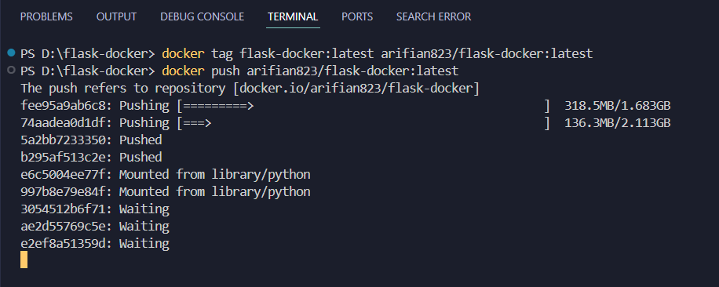

- Ketika proses push telah selesai, maka pada terminal akan seperti ini dan hasil push juga dapat diakses di repositori yang ada di Docker Hub.


- Pada Docker Hub, terdapat tag ```latest``` yang merupakan image yang telah di push. Setelah ini lanjut ke **tahap 4**.


## 4. Proses Deployment ke Code Engine

- Setelah ini, kita akan melalukan deployment ke Code Engine, buka IBM Cloud dan akses layanan Code Engine
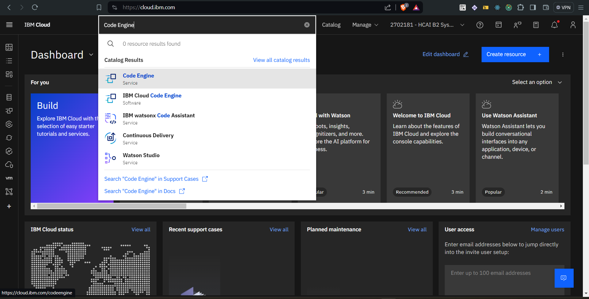

- Klik tombol biru 'Let's Go!'


- Pada halaman ini, silakan tekan tombol biru 'Create Project +'
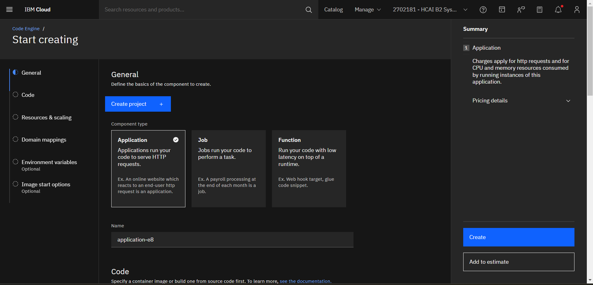

- Akan muncul tab di kanan untuk membuat project baru yang akan digunakan untuk menerima Docker Image yang sebelumnya di push ke Docker Hub


- Pastikan :
- Location : ```Dallas (us-south)```
- Name : Sesuka hati kalian, dalam kasus ini : ```project-1```
- Resource Group : ```Default``` (Jika tertulis 'No resource group available' silakan hubungi mentor untuk aktivasi akun. Atau tukar akun anda.)
- Tags : Biarkan kosong
- Lalu tekan tombol biru 'Create Project'

- Setelahnya, akan ada pilihan project di halaman pembuatan Application pada Code Engine, silakan pilih bagian 'Application'


- Scroll ke bawah, lalu pilih nama aplikasi, dalam kasus ini, akan digunakan nama ```flask-docker```.


- Pada bagian 'Code' , tekan tombol 'Configure Image' yang ada di kanan. Biarkan pilihan di **'Use an existing container image'.**


- Akan muncul tab di kanan, dan pilih 'registry server' yang bernama ```https://index.docker.io/v1```


- Untuk 'Registry secret' , pilih ```Create registry secret```


- Untuk pembuatan registry secret, isi sebagai berikut : 
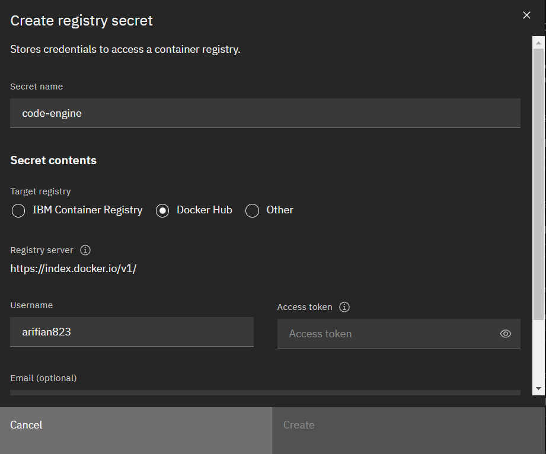

- Secret name : bebas, pada kasus ini : ```code-engine```
- Secret contents : ```Docker Hub```
- Registry server : Biarkan begitu saja, sebelumnya sudah dipilih ```https://index.docker.io/v1```
- Username : Username Docker Hub anda. Dalam kasus ini : ```arifian823```
- Access Token : Silakan ambil access token anda di akun Docker Hub anda.

- Pergi ke Docker Hub, lalu ke bagian 'Account Settings'


- Pergi ke tab 'Security'
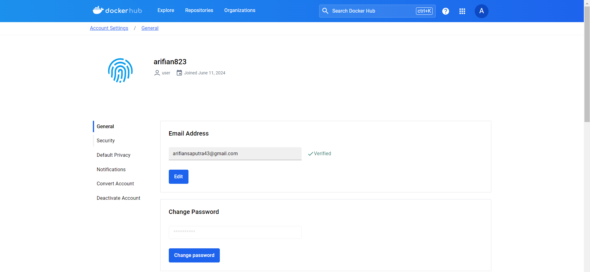

- Lalu, tekan tombol biru, 'New Access Token'


- Isi ```Access Token Description``` dengan nama sama dengan di IBM Cloud yaitu ```code-engine```, Access permissions dibiarkan saja di **Read, Write, Delete.** Lalu tekan tombol biru 'Generate'.


- Access Token anda ada di bawah, ini adalah contoh:
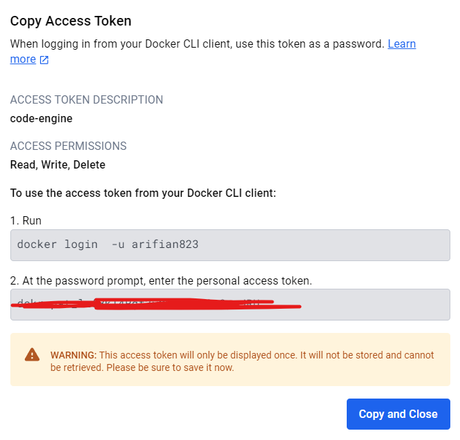

- Copy token tersebut dan paste di IBM Cloud Code Engine, lalu klik tombol biru 'Create'.
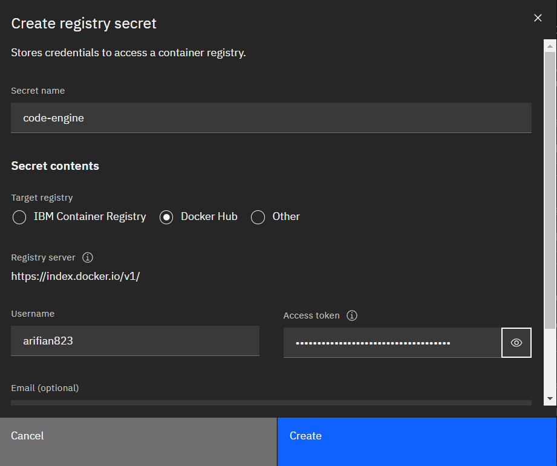

- Setelah membuat registry secret yang sesuai dengan akun Docker Hub, maka bagian namespace, image name dan tags akan terisi dengan sendirinya. Klik tombol biru 'Done'.


- Setelahnya, pada bagian 'Code', bagian 'Image reference' akan berisi link repositori Docker Hub anda.


- Scroll kebawah, pada bagian 'Resource and scaling'
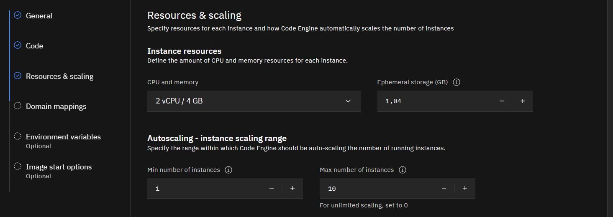

- CPU dan memory : sesuai kebutuhan, pada kasus ini, yang akan digunakan : ``` 2vCPU / 4GB ```

- Ephemeral Storage : sesuai kebutuhan, pada kasus ini, yang akan digunakan : ``` 1,04 GB ```

- Min number of instance : 1 (jangan lebih dari 1, itu sudah cukup untuk mempertahankan API tetap hidup walau tidak dipakai)

- Max number of instance : Biarkan di angka 10

- Scroll ke paling bawah, bagian 'Image start options'
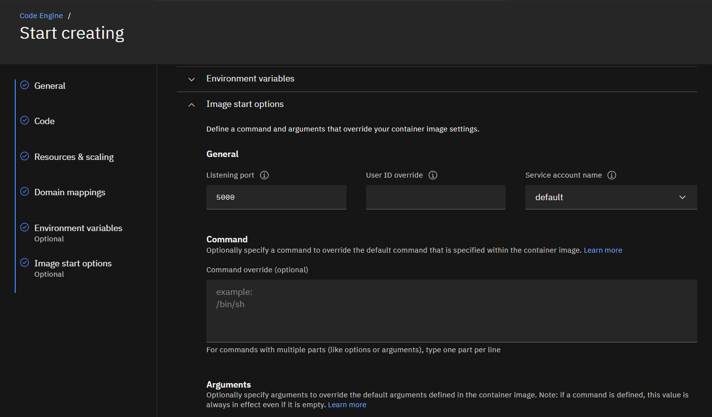

- Ubah **listening port dari 8080 ke ```5000```**

- Konfigurasi lainnya tidak perlu diubah, biarkan sedia kala. Sekarang tekan tombol biru 'Create' di tab kanan : 
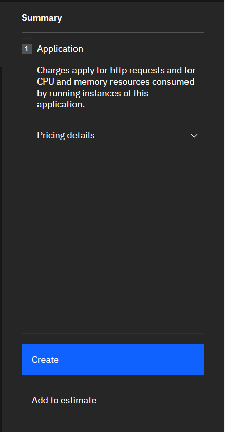

- Sekarang, tunggu proses deployment selesai, bisa memakan waktu 5-10 menit.
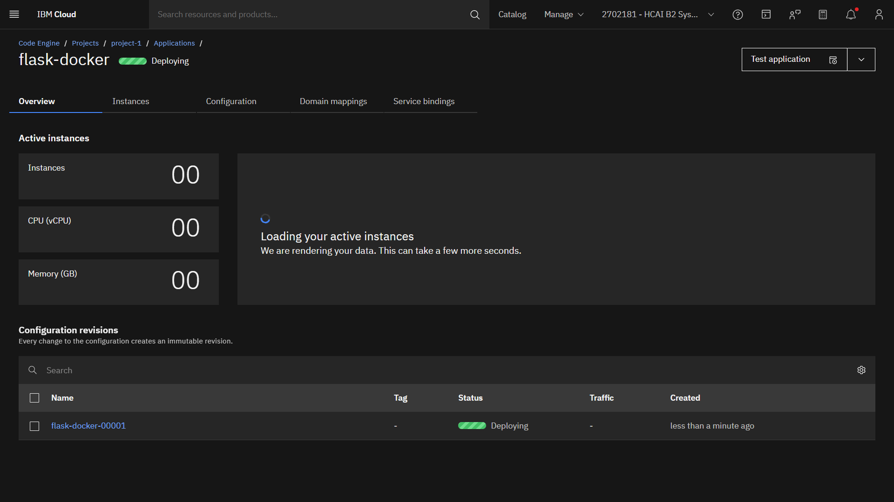

- Berikut adalah jika proses deployment berhasil dan sudah selesai.
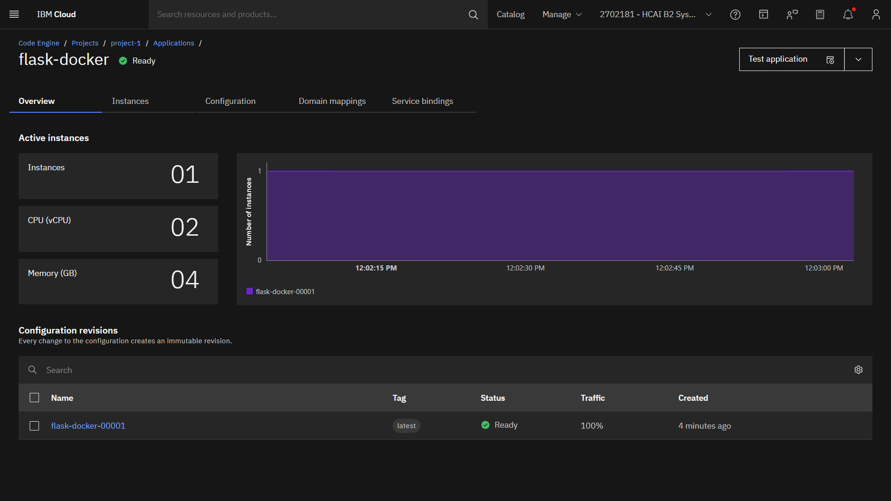

- Proses deployment sudah selesai, ambil link utama untuk dilakukan pengetesan, buka bagian 'Domain mappings'


- Link public tersebut adalah yang akan digunakan untuk melakukan testing. Disebut juga sebagai API Endpoint.

- Menyesuaikan dengan yang sebelumnya di local yaitu ```http://localhost:5000``` untuk route utama (/) dan ```http://localhost:5000/predict``` untuk route prediksi. Maka untuk kasus kali, berikut ini adalah endpoint API dari Flask API yang sudah ter-deploy : 

- Route utama (/) : 
```
https://flask-docker.1i36eco0q6b5.us-south.codeengine.appdomain.cloud 
```

- Route prediksi (/predict) :
```
 https://flask-docker.1i36eco0q6b5.us-south.codeengine.appdomain.cloud/predict 
```

## 5. Testing endpoint menggunakan React

- Sebelum pengetesan menggunakan React, buka aplikasi Postman, dan tes endpoint diatas menggunakan tata cara seperti sebelumnya:

- GET ```https://flask-docker.1i36eco0q6b5.us-south.codeengine.appdomain.cloud```
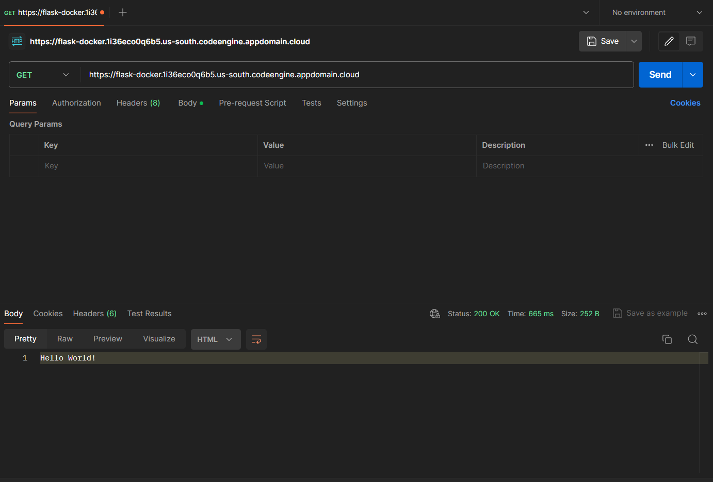
Hasil yang keluar, sesuai dengan yang seharusnya berada pada route (/) yaitu tulisan 'Hello World!'

- POST ```https://flask-docker.1i36eco0q6b5.us-south.codeengine.appdomain.cloud/predict```
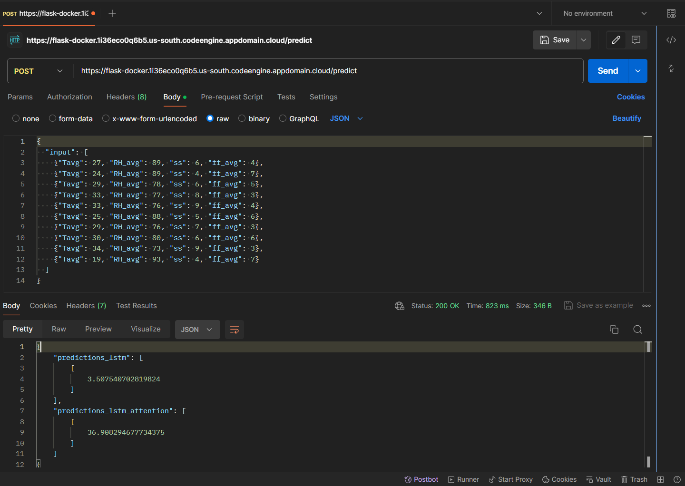
Lakukan post dengan contoh data sebelumnya diatas, dan hasil prediksi pun keluar dengan seharusnya.


---

<h3 align="center"> Infinite Learning Indonesia </h3>